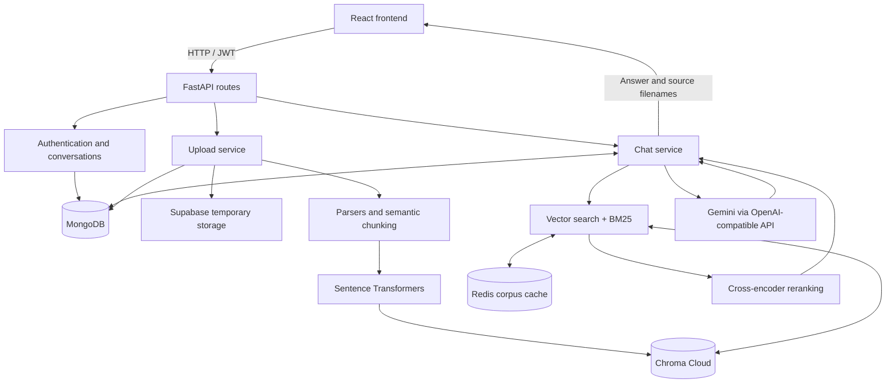

# AI-RAG — Document Chatbot

A full-stack Retrieval-Augmented Generation (RAG) application that turns uploaded documents into searchable conversations, using hybrid retrieval and Google Gemini to answer questions with source filenames.

## 📌 Overview

AI-RAG lets users register, create conversations, upload documents, and ask questions about their contents. A React frontend communicates with a FastAPI backend that extracts text, creates semantic chunks, and stores embeddings in Chroma Cloud. At question time, semantic search and keyword search retrieve context for Gemini.

The application is a development project. See **Installation** for current setup workarounds and **Limitations** for implementation gaps.

## ✨ Features

- Email/password registration and login with JWT bearer authentication.
- Named conversations and persisted chat history.
- PDF, DOCX, PPTX, and UTF-8 TXT uploads.
- Semantic chunking and local Sentence Transformers embeddings.
- Hybrid retrieval combining Chroma vector search and BM25 keyword search.
- Cross-encoder reranking of retrieved passages.
- Redis caching of the document corpus used for BM25.
- Gemini answers prompted to use retrieved document content, with limited conversation context.
- Markdown answer rendering and source filename chips in the chat interface.
- Temporary document storage in Supabase, removed after successful ingestion.

## 🏗️ Architecture



MongoDB stores users, conversations, document metadata, and messages. Chroma Cloud stores extracted text, vectors, and chunk metadata. Redis stores cached document text and tokenized corpora. Supabase holds original files temporarily during ingestion.

## 🛠️ Tech Stack

| Layer | Technologies |
| --- | --- |
| Frontend | React 19, Vite 8, React Router 7, Tailwind CSS 4, Axios |
| UI | Lucide React, React Icons, React Markdown |
| Backend | Python, FastAPI, Uvicorn, Pydantic Settings |
| Authentication | python-jose JWT, Passlib with bcrypt |
| Application database | MongoDB with Motor |
| Vector database | Chroma Cloud |
| Cache | Redis |
| Temporary storage | Supabase Storage |
| RAG utilities | LangChain, SemanticChunker, rank-bm25 |
| Embeddings | Sentence Transformers `all-MiniLM-L6-v2` |
| Reranking | `cross-encoder/ms-marco-MiniLM-L-6-v2` |
| Generation | Google Gemini through the OpenAI Python client's compatible endpoint |
| File parsing | PyMuPDF, python-docx, python-pptx, UTF-8 decoding |

Dependency versions are declared in `backend/requirements.txt` and `frontend/package.json`.

## 📂 Project Structure

```text
ai-rag-chatbot/
├── README.md
├── backend/
│   ├── .env                     # Local configuration; ignored by Git
│   ├── requirements.txt
│   └── app/
│       ├── main.py              # FastAPI app, CORS, router registration
│       ├── api/                 # Auth, user, conversation, upload, chat routes
│       ├── core/                # Settings, password hashing, JWT, auth dependency
│       ├── database/            # MongoDB and Chroma Cloud clients
│       ├── models/              # Model scaffolding
│       ├── schemas/             # Pydantic request schemas
│       ├── parsers/             # PDF, DOCX, PPTX, TXT text extraction
│       ├── services/            # Auth, upload, retrieval, reranking, generation
│       └── utils/               # Text cleaning, chunking, Redis client
├── frontend/
│   ├── package.json
│   ├── vite.config.js
│   ├── public/
│   └── src/
│       ├── main.jsx             # React entry point
│       ├── App.jsx
│       ├── routes/              # Application routes
│       ├── pages/               # Landing, login, register, chat
│       ├── components/          # Auth, chat, shared UI
│       ├── context/             # Auth and conversation state
│       ├── hooks/               # Context access hooks
│       ├── services/            # Axios client and API wrappers
│       ├── assets/
│       └── utils/
└── test.txt                     # Sample text file, not an automated test suite
```

## ⚙️ How It Works

1. **Authenticate:** passwords are hashed with bcrypt. Login returns a JWT, which the frontend stores in local storage and attaches to API requests.
2. **Create a conversation:** the backend records its title and user ID in MongoDB.
3. **Ingest a document:** the backend temporarily uploads the file to Supabase, downloads its bytes, selects a parser, and cleans the extracted text.
4. **Index its content:** `SemanticChunker` splits text into semantic passages. Each passage is embedded and written to Chroma Cloud with conversation ID, user ID, filename, and chunk index.
5. **Finish ingestion:** document metadata is added to MongoDB and the temporary Supabase object is deleted.
6. **Retrieve context:** a question, optionally enhanced with stored conversation context, drives vector search and BM25. The chat path requests up to 25 candidates from each search, merges them, and deduplicates by text.
7. **Rerank:** a cross-encoder ranks the candidates. The implementation keeps up to eight passages from the same filename as the highest-ranked result.
8. **Generate and persist:** Gemini receives the question, retrieved passages, and limited history. The answer and source filenames are returned, and both messages are saved in MongoDB.

## 🚀 Installation

### Prerequisites

- Git, Python 3.11 as a practical starting environment, and Node.js 22.12+ with npm. The repository does not declare a tested Python version matrix.
- A reachable MongoDB instance and Redis instance.
- A Chroma Cloud database with API credentials.
- A Supabase project and an existing Storage bucket; the backend key must allow upload, download, and deletion in that bucket.
- A Gemini API key and a model ID available to that key.
- Internet access for hosted services and initial embedding/reranker model downloads.

### Get the code and dependencies

```bash
git clone https://github.com/o-m-s-h/ai-rag-chatbot.git
cd ai-rag-chatbot
```

Backend, from the repository root:

```powershell
cd backend
python -m venv venv
.\venv\Scripts\Activate.ps1
python -m pip install --upgrade pip
python -m pip install -r requirements.txt
python -m pip install "bcrypt==4.0.1"
```

On macOS/Linux, activate with `source venv/bin/activate`. The extra bcrypt installation supplies the password-hashing backend missing from `requirements.txt`, using a version compatible with Passlib 1.7.4.

Frontend, in another terminal from the repository root:

```bash
cd frontend
npm install
```

Create `backend/.env` using the **Environment Variables** section before starting the backend.

### Current startup workarounds

- `backend/app/utils/chunking.py` imports `Embeddings` from the legacy `langchain.embeddings.base` path. If the declared LangChain version raises an import error, change that import to `from langchain_core.embeddings import Embeddings`.
- `backend/app/api/upload_routes.py` opens a separate local Chroma collection with `get_collection` during import. On a fresh checkout, create that collection once **from `backend/`**:

  ```bash
  python -c "import chromadb; chromadb.PersistentClient(path='./chroma_storage').get_or_create_collection(name='rag_collection')"
  ```

  This only satisfies the debug route's local collection requirement. Actual uploads and retrieval use Chroma Cloud; the local debug endpoint does not reflect that data.
- Redis is pinged during module import, and cloud clients/models are initialized during startup. Unreachable services, missing settings, or model download failures can prevent startup.

These are documented workarounds; this README does not change the application code.

## 🚀 Flow of data through various files

### Registration and login

```text
RegisterForm.jsx / LoginForm.jsx
  → services/authService.js → services/axiosInstance.js
  → api/auth_routes.py → schemas/user_schema.py
  → services/auth_service.py
  → core/security.py + database/mongodb.py
  → core/jwt_handler.py (login token)
  → context/AuthContext.jsx (local storage and React state)
```

### Document upload

```text
pages/ChatPage.jsx → services/uploadService.js → services/axiosInstance.js
  → api/upload_routes.py → core/dependencies.py (JWT validation)
  → services/upload_service.py
  → services/supabase_service.py (upload and download bytes)
  → parsers/{pdf,docx,pptx,txt}_parser.py
  → utils/text_cleaner.py → utils/chunking.py
  → services/embedding_service.py → database/chroma_db.py
  → database/mongodb.py (document metadata)
  → services/supabase_service.py (temporary file deletion)
  → frontend receives filename and chunks_stored
```

### Question and answer

```text
pages/ChatPage.jsx → services/chatService.js → services/axiosInstance.js
  → api/chat_routes.py → core/dependencies.py
  → services/chat_service.py → database/mongodb.py (history)
  → services/retrieval_service.py
      → services/embedding_service.py + database/chroma_db.py (vector search)
      → utils/redis_client.py / Chroma corpus + BM25 (keyword search)
      → services/rerank_service.py (rank and select passages)
  → services/gemini_service.py (generate answer)
  → database/mongodb.py (save user and assistant messages)
  → components/chat/ChatMessage.jsx (Markdown and sources)
```

`services/rag_service.py` and the encryption service/core files are currently empty scaffolding; the active pipeline is coordinated by `chat_service.py` and `upload_service.py`.

## 🔐 Environment Variables

Create `backend/.env`. All fields below are required by `app/core/config.py`, including the currently unused encryption key. Replace placeholders with your own values; never commit credentials.

```dotenv
MONGO_URI=mongodb://localhost:27017
REDIS_URL=redis://localhost:6379/0

JWT_SECRET=replace-with-a-long-random-secret
JWT_ALGORITHM=HS256
ACCESS_TOKEN_EXPIRE_MINUTES=60

GEMINI_API_KEY=your-gemini-api-key
GEMINI_MODEL=your-available-gemini-model-id

ENCRYPTION_KEY=reserved-unused-value

SUPABASE_URL=https://your-project.supabase.co
SUPABASE_KEY=your-backend-storage-key
SUPABASE_BUCKET=your-existing-bucket

CHROMA_API_KEY=your-chroma-api-key
CHROMA_TENANT=your-chroma-tenant
CHROMA_DATABASE=your-chroma-database
```

| Variables | Purpose |
| --- | --- |
| `MONGO_URI` | MongoDB connection; code selects the `ai_rag_chatbot` database |
| `REDIS_URL` | Redis connection for the one-hour BM25 corpus cache |
| `JWT_SECRET`, `JWT_ALGORITHM`, `ACCESS_TOKEN_EXPIRE_MINUTES` | Token signing, validation, and lifetime |
| `GEMINI_API_KEY`, `GEMINI_MODEL` | Gemini credentials and generation model |
| `ENCRYPTION_KEY` | Required setting; application-level encryption is not implemented |
| `SUPABASE_URL`, `SUPABASE_KEY`, `SUPABASE_BUCKET` | Temporary document storage |
| `CHROMA_API_KEY`, `CHROMA_TENANT`, `CHROMA_DATABASE` | Chroma Cloud connection |

No frontend environment variable is currently read by the Axios client. Its API URL is hardcoded to `http://127.0.0.1:8000` in `frontend/src/services/axiosInstance.js`. Backend CORS allows `http://localhost:5173` in `backend/app/main.py`; update both files if changing deployment addresses. Keep backend secrets out of frontend configuration.

## ▶️ Running the Project

Start MongoDB and Redis, ensure hosted services are configured, and apply the startup workarounds above.

Terminal 1, from `backend/` with the virtual environment active:

```bash
python -m uvicorn app.main:app --reload --host 127.0.0.1 --port 8000
```

Terminal 2, from `frontend/`:

```bash
npm run dev -- --port 5173 --strictPort
```

- Frontend: [http://localhost:5173](http://localhost:5173)
- Backend status: [http://127.0.0.1:8000](http://127.0.0.1:8000)
- Interactive API docs: [Swagger UI](http://127.0.0.1:8000/docs)
- Alternative API docs: [ReDoc](http://127.0.0.1:8000/redoc)

Run the backend from `backend/` so `.env` and the local debug storage resolve consistently. Use `localhost:5173` for the frontend to match the configured CORS origin.

## 📖 Usage

1. Open the frontend and register an account.
2. Log in and create a named conversation.
3. Use the attachment control to upload a supported document into that conversation.
4. Wait for upload processing to finish before asking a question.
5. Ask a specific question about the uploaded content.
6. Read the answer and review the displayed source filenames.
7. Reopen the conversation from the sidebar to load saved messages.

Upload a document before chatting: retrieval does not currently handle an empty document corpus gracefully. Duplicate filenames within a conversation are rejected.

## 🧪 How to Use and Test

### Manual smoke test

1. Visit the backend status URL. Expect `{"message":"AI RAG Backend Running"}`. This checks the route response, not the health of every dependency.
2. Register and log in through the frontend. Confirm a conversation can be created and appears in the sidebar.
3. Create a UTF-8 file named `project-notes.txt` containing the sample in **Example**, then upload it.
4. Ask the sample question. Check that the answer reflects the file and displays `project-notes.txt` as a source.
5. Refresh the page and reopen the conversation. Verify both messages are restored.
6. Upload the same filename again. The API should return HTTP 400 with `File already uploaded`; inspect the browser Network panel because upload errors are currently logged to the console.
7. Ask a question whose answer is absent. The prompt requests the fallback shown below; verify actual model behavior rather than assuming it is guaranteed.

### API testing with Swagger UI

1. Open `/docs` and execute `POST /auth/register` with `username`, `email`, and `password`.
2. Execute `POST /auth/login` with `email` and `password`; copy the returned `token`.
3. Click **Authorize** and paste the token into the HTTP bearer field.
4. Execute `POST /conversations/` with `{"title":"Test documents"}` and copy `conversation_id`.
5. Execute `POST /upload/{conversation_id}` with that ID and a file selected in the multipart `file` field.
6. Execute `POST /chat/{conversation_id}` with `{"message":"What is the project deadline?"}`.
7. Execute `GET /chat/{conversation_id}/messages` to verify persistence.

### Frontend checks

From `frontend/`:

```bash
npm run lint
npm run build
```

These run ESLint and the production build. They are not end-to-end tests, and existing source issues may cause lint failures. The repository currently has no automated test suite or `npm test` script. Installation, startup, and hosted-service integration have not been verified as part of this documentation change.

## 💡 Example

Upload `project-notes.txt` containing:

```text
The Atlas project deadline is 30 November 2026.
The project owner is Priya.
The team reviews progress every Friday.
```

**Question:** What is the project deadline?

**Illustrative response** (wording may vary):

```json
{
  "success": true,
  "answer": "The Atlas project deadline is 30 November 2026.",
  "sources": ["project-notes.txt"]
}
```

For “What is the project budget?”, the generation prompt requests:

> I could not find that information in the uploaded documents.

## 🔌 API Endpoints

Protected endpoints require `Authorization: Bearer <token>`.

| Method | Endpoint | Authentication | Request / purpose |
| --- | --- | --- | --- |
| GET | `/` | No | Backend status message |
| POST | `/auth/register` | No | JSON: `username`, `email`, `password` |
| POST | `/auth/login` | No | JSON: `email`, `password`; returns `token` on success |
| GET | `/user/me` | Bearer | Returns decoded token claims |
| POST | `/conversations/` | Bearer | JSON: `title`; creates a conversation |
| GET | `/conversations/` | Bearer | Lists the authenticated user's conversations |
| POST | `/upload/{conversation_id}` | Bearer | Multipart `file`; returns filename and chunk count |
| POST | `/chat/{conversation_id}` | Bearer | JSON: `message`; returns answer and sources |
| GET | `/chat/{conversation_id}/messages` | Bearer | Returns messages filtered by conversation and user |
| GET | `/upload/debug/chroma` | No | Chunk count and five samples from the separate local collection |

FastAPI also provides `/docs`, `/redoc`, and `/openapi.json`. Registration/login failures currently use response bodies with `success: false`, rather than dedicated error status codes. The debug endpoint is unauthenticated and should be removed or restricted before public deployment.

## 🧠 Design Decisions

- **Hybrid retrieval:** vectors capture semantic similarity while BM25 helps match exact terms. A cross-encoder chooses the most relevant passages after merging both result sets.
- **Semantic chunks:** embedding-based boundaries aim to keep related text together instead of relying on a fixed character count.
- **Separate storage roles:** MongoDB holds application records; Chroma holds searchable chunks; Redis caches the BM25 corpus; Supabase temporarily holds original files.
- **Local embedding and reranking models:** those steps run in the backend process, while answer generation uses hosted Gemini.
- **Source-focused context:** keeping passages from the top-ranked filename focuses the answer on one document, at the cost of cross-document synthesis.
- **Thin routes and service modules:** request validation and authentication sit near routes, while ingestion and chat orchestration live in services.

## ⚠️ Limitations

- **Authorization is incomplete:** upload and chat processing do not verify conversation ownership before using the supplied ID. Retrieval and history-context queries filter by conversation ID without enforcing the authenticated user. This must be fixed before multi-user deployment.
- **Startup needs attention:** the legacy LangChain import, missing explicit bcrypt dependency, and separate local debug collection can block a fresh setup.
- **No OCR:** scanned PDFs and image-only slides are not understood. DOCX extraction reads paragraphs, and richer layouts/tables may be missed.
- **Empty input handling is incomplete:** empty documents or conversations without indexed chunks can cause retrieval errors.
- **Cached content can be stale:** the BM25 corpus cache lasts one hour and uploads do not invalidate it. Vector search can see newly added chunks while BM25 still uses older content.
- **History ordering needs correction:** chat context reads sort by `created_at`, but new messages store `timestamp`; only three message records are requested.
- **Single-source answers:** retrieval returns passages only from the highest-ranked filename. Sources are filenames without page-level citations.
- **Upload processing is synchronous:** no upload size limit, background job queue, or robust failure cleanup is implemented. Temporary paths use filenames and can collide across concurrent uploads.
- **Generation is fallible:** prompting does not guarantee factual answers. Gemini exceptions are returned as answer text and may still be saved with `success: true`.
- **Deployment hardening is unfinished:** tokens live in browser local storage, the debug endpoint has no authentication, and application-level document encryption is not implemented.
- **No automated test suite, document deletion API, conversation deletion API, or streamed generation** is currently implemented.

## 🔮 Future Improvements

- Enforce ownership across uploads, retrieval, and conversation history access.
- Consolidate Chroma clients, update dependency imports, and make fresh installation reproducible.
- Add unit, API integration, and browser workflow tests with isolated test data.
- Invalidate BM25 caches after uploads and handle empty corpora explicitly.
- Fix history ordering and introduce a token-budgeted conversation memory strategy.
- Add page/slide citations, cross-document synthesis, and retrieval quality evaluations.
- Support OCR and richer document/table extraction.
- Move ingestion to background jobs with file validation, size limits, unique storage paths, and reliable cleanup.
- Add deletion workflows, streaming responses, and clearer frontend error messages.
- Configure frontend API URLs and CORS through deployment settings; restrict debug access and add service health checks.

## 📄 License

No license file is currently included in this repository. Reuse and distribution permissions have not been specified; contact the author before reusing the code.

## 👨‍💻 Author

**Omkar M Shewalkar** · [GitHub](https://github.com/o-m-s-h)

Repository: [o-m-s-h/ai-rag-chatbot](https://github.com/o-m-s-h/ai-rag-chatbot)
